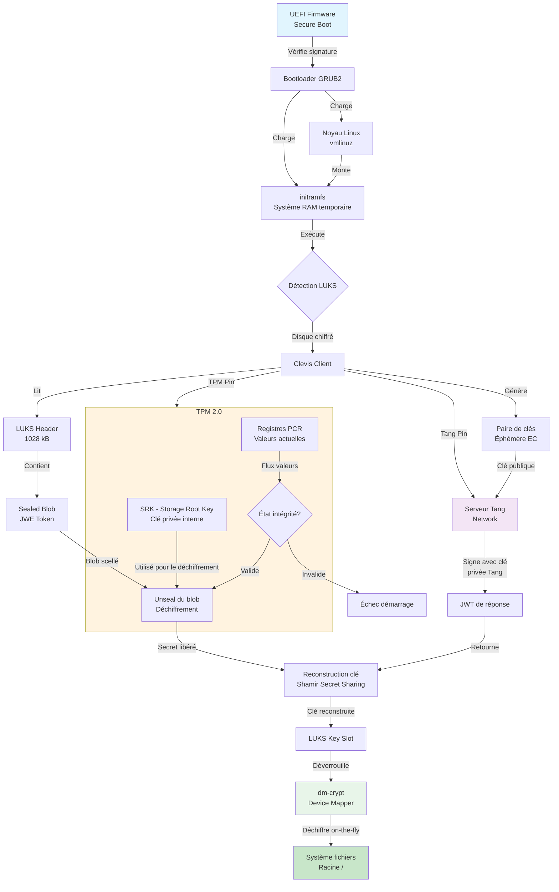

# Rapport Technique : Orchestration du Démarrage Linux et Sécurisation par Chiffrement de Disque

## 1. Introduction et enjeux de la sécurité des données au repos

La protection des données "at rest" (au repos) est un impératif stratégique pour toute architecture système moderne. Le chiffrement complet du disque (FDE - Full Disk Encryption) constitue la première ligne de défense contre l'extraction de données suite au vol physique d'un matériel. Cependant, une implémentation robuste ne peut se limiter au chiffrement seul ; elle nécessite une orchestration complexe de la gestion des clés.

Dans un contexte professionnel, la saisie manuelle d'un mot de passe est souvent inadaptée (serveurs distants, flottes de terminaux). La sécurité repose alors sur l'automatisation via des solutions d'authentification liées au réseau ou au matériel. L'objectif est de garantir que le disque ne peut être déverrouillé que si l'intégrité de la chaîne de démarrage est vérifiée et que l'appareil se trouve dans un environnement de confiance. Cette architecture s'appuie sur le standard industriel LUKS.

## 2. Fondamentaux du chiffrement : LUKS et dm-crypt

LUKS (Linux Unified Key Setup) définit le cadre standard pour le chiffrement de disque sous Linux. Son architecture dissocie la gestion des métadonnées (le Header) du processus technique de chiffrement.

Le Header LUKS, d'une taille spécifique de 1028 kB dans notre architecture de référence, contient les éléments critiques :

* Signature LUKS : Identifiant du volume chiffré.
* Algorithme d'encryption : Spécifie la méthode utilisée (ex: AES-XTS).
* Paramètres Argon2 : Utilisés pour la dérivation de clés, rendant les attaques par force brute extrêmement coûteuses en ressources.
* Key Slots : Jusqu'à 32 emplacements dans LUKS2 pour stocker les phrases de passe ou les jetons (tokens).
* Sealed Blob : Une enveloppe JWE stockée dans les jetons LUKS2, contenant les secrets scellés liés aux politiques PCR du TPM.

| Caractéristique | LUKS2 | dm-crypt |
|-----------------|-------|----------|
| Rôle | Gestion des clés et métadonnées | Chiffrement effectif "on the fly" |
| Emplacement | Header du disque (Userspace/Tools) | Noyau Linux (Kernel) |
| Fonctionnement | Gère les slots via Argon2 | Module de type Device Mapper |
| Transparence | Visible via l'utilitaire cryptsetup | Transparent pour les couches supérieures |

L'adoption d'Argon2 pour la dérivation des clés est une évolution majeure de LUKS2. En forçant une consommation élevée de mémoire et de temps CPU, Argon2 neutralise l'efficacité des accélérateurs matériels (GPU/ASIC) utilisés par les attaquants, garantissant une robustesse accrue même face à des mots de passe de complexité moyenne.

## 3. L'orchestration du démarrage Linux (Boot Process)

Comprendre le déverrouillage automatique exige de maîtriser la séquence de démarrage, véritable chaîne de confiance dont chaque maillon vérifie le suivant.

1. UEFI Firmware : Premier programme exécuté. Il réalise l'initialisation matérielle et le POST (Power-On Self-Test). Son rôle est critique grâce au Secure Boot, qui valide la signature numérique des composants de démarrage initiaux. Le Boot Manager sélectionne ensuite le périphérique de boot.
2. Bootloader (GRUB2) : Chargé par l'UEFI en tant qu'application EFI. Il présente le menu de sélection et charge en RAM le noyau (vmlinuz) ainsi que le disque RAM initial (initramfs).
3. Le Noyau (Kernel) : Une fois actif, il gère les ressources (CPU, mémoire) et monte l'initramfs comme système de fichiers racine temporaire.

Le firmware UEFI agit comme la racine de confiance matérielle. Si l'UEFI est compromis, l'intégralité du système est vulnérable avant même le chargement de la première ligne de code de l'OS. C'est l'étape où le matériel atteste de l'intégrité logicielle.

## 4. Le pivot de la sécurité : l'Initial RAM Disk (initramfs)

L'initramfs est un système de fichiers temporaire en RAM contenant les pilotes et scripts nécessaires pour accéder au système de fichiers racine réel (souvent chiffré).

Lors de son exécution, il suit des étapes strictes :

* Chargement des modules noyau (drivers) pour détecter le matériel.
* Exécution des scripts d'initialisation.
* Déclenchement du déverrouillage du disque via Clevis si le chiffrement est détecté.

Il est essentiel de distinguer :

* Hooks Scripts : Utilisés lors de la génération de l'image pour inclure des binaires (ex: clevis), des fichiers de configuration ou des modules spécifiques.
* Boot Scripts : Exécutés lors du démarrage effectif avant le montage de la racine réelle.

La personnalisation de l'initramfs est le pivot stratégique de notre architecture. C'est ici que sont injectés les mécanismes de Network-Bound Disk Encryption (NBDE), transformant un démarrage passif en une authentification dynamique et contextuelle.

## 5. Automatisation du déverrouillage : Clevis, Tang et TPM

L'automatisation repose sur le couplage de Clevis avec des agents de confiance (pins).

* Clevis : Le client qui lie (bind) LUKS à des backends. Il utilise l'algorithme SSS (Shamir’s Secret Sharing) pour fragmenter la clé. Par exemple, un schéma "3 sur 5" permet de déverrouiller le disque même si certains segments réseau ou serveurs Tang sont indisponibles, offrant une redondance critique.
* TPM (Trusted Platform Module) : Puce matérielle gérant le "Sealing" (scellement).
  * La SPS (Storage Primary Seed) est générée par le TRNG (True Random Number Generator) physique du TPM.
  * La SRK (Storage Root Key) est dérivée de la SPS via une fonction de dérivation de clé (KDF).
  * Le processus utilise un Chiffrement Hybride : l'AES gère les données (usage unique), tandis que l'RSA protège la clé AES via la partie publique de la SRK. Seul le TPM local, possédant la partie privée de la SRK, peut désarchiver ce secret, et seulement si les registres PCR (Platform Configuration Registers) correspondent à l'état d'intégrité attendu.
* Tang : Serveur sans état (stateless) pour le déverrouillage réseau. Contrairement aux serveurs de clés classiques, il ne stocke pas de base de données de clés clients, ce qui simplifie la maintenance et réduit la surface d'attaque.
  * Audit et Maintenance : Les clés privées résident dans /var/tang. L'audit est assuré par systemd-journald, permettant de tracer l'IP du client, la méthode HTTP et l'ID de la clé utilisée.

Cette approche "stateless" et distribuée garantit qu'aucune entité unique (hors du TPM local) ne possède le secret complet, tout en permettant une gestion de parc centralisée.

## 5.1. Diagramme d'orchestration du déverrouillage

## 6. Intégrité et limitations de sécurité

L'automatisation crée un risque : si un attaquant modifie l'initramfs (en y injectant un keylogger), Clevis pourrait déverrouiller le disque pour un système compromis.

* Solution d'intégrité : Le Secure Boot est le verrou indispensable. Il utilise un Shim (signé par Microsoft) pour charger GRUB2, lui-même validé par une MOK (Machine Owner Key) stockée en NVRAM.
* Durcissement avancé : L'usage de l'outil ukify est recommandé pour générer des Unified Kernel Images (UKI). Les UKI regroupent le noyau, l'initramfs et la ligne de commande en un seul binaire signé, empêchant toute manipulation isolée de l'initramfs.
* Limitations physiques : Le chiffrement du disque ne protège pas contre l'extraction de clés depuis la RAM (attaques "Cold Boot"). Il est crucial d'activer le chiffrement total de la mémoire (AMD SME ou Intel TME) et de désactiver l'hibernation, car les images RAM sont écrites en clair sur le swap.

Le Secure Boot ne doit pas être vu comme une option, mais comme la condition sine qua non de la validité du chiffrement automatique : il garantit que le secret n'est libéré que pour un code authentique.

## 7. Conclusion

La sécurité des données au repos résulte d'une synergie entre LUKS2 pour le chiffrement, Clevis/Tang pour l'automatisation contextuelle, et le TPM pour l'attestation matérielle. Cette architecture multi-couche déplace la confiance du simple secret statique vers une preuve dynamique d'intégrité. Le maillon le plus sensible reste l'intégrité du pré-chargement (bootloader/initramfs), d'où l'importance capitale du Secure Boot et des Unified Kernel Images pour sceller définitivement cette infrastructure de confiance.

--------------------------------------------------------------------------------
