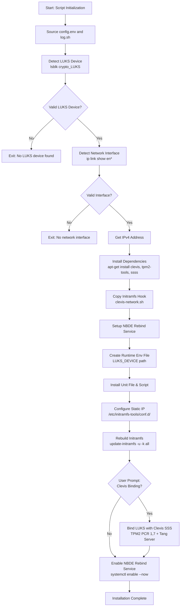

# MVP/install.sh Detailed Technical Summary

## Overview
This Bash script automates the setup of **Network Bound Disk Encryption (NBDE)** for LUKS-encrypted disks, using the Clevis framework with TPM2 hardware security and a Tang NBDE server for automatic disk unlocking. It configures early-boot networking, installs required services, and optionally binds the LUKS device to a Clevis policy that combines TPM2 integrity checks and Tang server-based unlocking.

Designed for Debian/Ubuntu-based Linux systems, it requires root privileges to execute (uses `apt-get`, modifies initramfs, systemd units, and LUKS metadata).

## Prerequisites
The script relies on two external files in the `MVP/` directory:
1. `config.env`: Defines required variables:
   - `NBDE_ENV_FILE`: Path to the runtime environment file for the rebind service
   - `GATEWAY`, `NETMASK`: Network configuration for static initramfs IP
   - `TANG_SERVER_URL`: URL of the Tang NBDE server
   - `UNIT_INSTALL_DIR`: Directory to install systemd unit files
   - `SCRIPTS_INSTALL_DIR`: Directory to install executable scripts
   - `SERVICE_NAME`: Name of the NBDE rebind systemd service
2. `lib/log.sh`: Provides the `log_info` function for formatted logging.

It also references external files that must exist in the `MVP/` directory:
- `lib/clevis-network.sh`: Initramfs hook to enable networking in early boot
- `units/nbde-rebind.service`: Systemd unit file for the rebind service
- `scripts/nbde-rebind-check.sh`: Rebind check script installed to the system

## Section-by-Section Breakdown

### 1. Initialization & Environment Setup (Lines 1–7)
```bash
#!/bin/bash
set -euo pipefail

SCRIPT_DIR="$(cd "$(dirname "${BASH_SOURCE[0]}")" && pwd)"

source "$SCRIPT_DIR/config.env"
source "$SCRIPT_DIR/lib/log.sh"
```
- Uses Bash strict mode (`set -euo pipefail`) to exit on errors, undefined variables, or failed pipe commands.
- `SCRIPT_DIR` resolves the absolute path of the script's directory to reliably reference relative files.
- Sources configuration and logging utilities from the script's directory.

### 2. LUKS Device Detection (Lines 9–15)
```bash
# Find device that is in LUKS Format
TARGET_DEV="/dev/$(lsblk -lo NAME,FSTYPE | awk '$2 == "crypto_LUKS" {print $1}')"

if [ "${#TARGET_DEV}" -lt 5 ]; then
    echo "No LUKS device found."
    exit 1
fi
```
- Scans all block devices using `lsblk` to find entries with FSTYPE `crypto_LUKS` (LUKS-encrypted disks).
- Constructs the full `/dev/` path for the detected device.
- Validates the device was found by checking if the path length is at least 5 characters (the length of `/dev/`), exits with an error if not.

### 3. Network Interface & IP Detection (Lines 17–24)
```bash
IFACE=$(ip link show | grep "^[0-9]: en" | head -1 | awk '{print $2}' | sed 's/:$//')

if [ -z "${IFACE// }" ]; then
    echo "No network interface found. Exiting."
    exit 1
fi

IP_ADDR=$(ip -4 addr show $IFACE | awk '/inet / {print $2}' | cut -d/ -f1)
```
- Detects the first Ethernet interface (names starting with `en`) using `ip link show`, stripping trailing colons from the interface name.
- Exits if no valid Ethernet interface is found.
- Extracts the IPv4 address (without CIDR subnet mask) of the detected interface for initramfs network configuration.

### 4. Dependency Installation & Initramfs Hook Setup (Lines 26–32)
```bash
# -----------------------------------------------------------------------------
# Install dependencies
# -----------------------------------------------------------------------------
apt-get update && apt-get install -y cryptsetup clevis clevis-luks clevis-tpm2 clevis-initramfs tpm2-tools ssss

cp ./lib/clevis-network.sh /etc/initramfs-tools/hooks/clevis-network
chmod +x /etc/initramfs-tools/hooks/clevis-network
```
- Installs required packages:
  - `cryptsetup`: LUKS disk encryption management
  - Clevis suite (`clevis`, `clevis-luks`, `clevis-tpm2`, `clevis-initramfs`): Framework for automated disk unlocking
  - `tpm2-tools`: Utilities for interacting with TPM2 hardware
  - `ssss`: Shamir's Secret Sharing implementation for splitting unlock secrets
- Copies the `clevis-network.sh` initramfs hook to the system's initramfs hooks directory and marks it executable. This hook enables networking in the early boot environment (initramfs) so the system can reach the Tang server to unlock the disk before the root filesystem is mounted.

### 5. NBDE Rebind Service Configuration (Lines 34–48)
```bash
log_info "Installing NBDE rebind service…"

# Write runtime env file — systemd injects LUKS_DEVICE into the script at boot
mkdir -p "$(dirname "$NBDE_ENV_FILE")"
echo "LUKS_DEVICE=${TARGET_DEV}" > "$NBDE_ENV_FILE"
chmod 600 "$NBDE_ENV_FILE"

# Install unit file and the rebind script to their final locations
install -Dm 644 "$SCRIPT_DIR/units/nbde-rebind.service" \
    "${UNIT_INSTALL_DIR}/nbde-rebind.service"
install -Dm 755 "$SCRIPT_DIR/scripts/nbde-rebind-check.sh" \
    "${SCRIPTS_INSTALL_DIR}/nbde-rebind-check.sh"

log_info "Unit and script installed."
```
- Creates the parent directory for the NBDE runtime environment file (path from `config.env`) and writes the detected LUKS device path to it. Sets permissions to `600` (owner-only read/write) to restrict access to the sensitive device path.
- Installs the systemd unit file with read-only permissions (`644`) and the rebind check script with executable permissions (`755`) using `install -Dm` (which automatically creates parent directories if missing).

### 6. Initramfs Static IP Configuration (Lines 50–58)
```bash
# -----------------------------------------------------------------------------
# Static IP for initramfs (network unlock)
# -----------------------------------------------------------------------------
mkdir -p /etc/initramfs-tools/conf.d/
echo "IP=${IP_ADDR}::${GATEWAY}:${NETMASK}::${IFACE}:off" > /etc/initramfs-tools/conf.d/static_ip

log_info "Rebuilding initramfs…"

update-initramfs -u -k all
```
- Writes a static IP configuration to the initramfs-tools config directory. The format follows initramfs-tools conventions: `IP=<ip>::<gateway>:<netmask>::<interface>:off` (using variables from `config.env` for gateway and netmask). This ensures the initramfs can bring up the network interface with a static IP to reach the Tang server.
- Rebuilds all initramfs images to apply the new hook and static IP configuration.

### 7. Optional Clevis LUKS Binding (Lines 60–71)
```bash
# -----------------------------------------------------------------------------
# Clevis LUKS binding
# -----------------------------------------------------------------------------
read -p "clevis binding [y,N]" clevis_binding

if [ "$clevis_binding" = "y" ]; then
    SSS_CONFIG=$(printf \
        '{"t": 2, "pins": {"tpm2": {"pcr_ids": "1,7"}, "tang": [{"url": "%s"}]}}' \
        "$TANG_SERVER_URL"
    )
    clevis luks bind -d "$TARGET_DEV" sss "$SSS_CONFIG"
fi
```
- Prompts the user to confirm whether to bind the LUKS device to a Clevis policy.
- If confirmed, generates a Shamir's Secret Sharing (SSS) configuration JSON:
  - `t: 2`: Threshold of 2 shares required to reconstruct the LUKS unlock secret (matches the 2 sub-pins defined).
  - `pins`: Two sub-pins generate two shares of the secret:
    1. `tpm2`: Seals one share to the system's TPM2 module, locked to PCR registers 1 (platform firmware configuration) and 7 (Secure Boot policy). The TPM will only release this share if the current PCR values match the values present when the secret was sealed.
    2. `tang`: Seals the second share to the Tang server at the URL specified in `config.env`.
- Runs `clevis luks bind` to add a new LUKS key slot containing the SSS-encrypted unlock secret. This requires entering the existing LUKS passphrase to authorize the new slot. The disk can then be unlocked by satisfying the Clevis policy (or using the original LUKS passphrase on other slots).

### 8. Service Activation & Completion (Lines 73–75)
```bash
systemctl enable --now "$SERVICE_NAME"

log_info "Installation complete."
```
- Enables and starts the NBDE rebind systemd service (name from `config.env`) to run on boot.
- Logs final completion message.

## Key Technical Notes
- **TPM2 PCR Registers**: PCR 1 measures platform firmware configuration (UEFI settings, NVRAM variables), PCR 7 measures Secure Boot policy (certificates, enable state). Binding to these registers prevents unlocking if firmware or Secure Boot settings are tampered with.
- **Shamir's Secret Sharing**: The `t=2` threshold means both shares (TPM2 and Tang) are required to reconstruct the LUKS secret by default, though Clevis may support alternative unlock paths depending on configuration.
- **Initramfs Requirements**: Networking in initramfs is required to reach the Tang server before the root filesystem is mounted, hence the static IP and custom hook.

## Workflow Diagram


